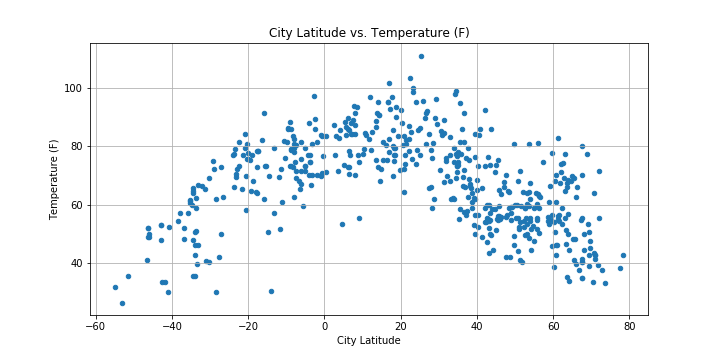
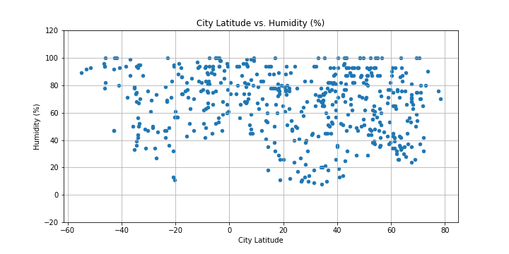
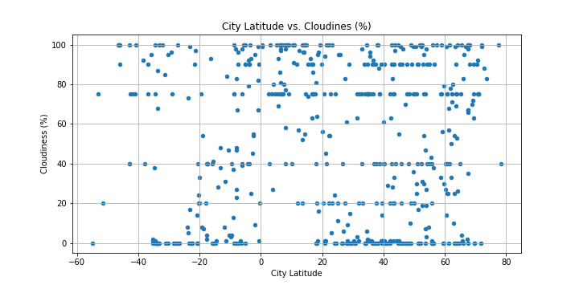
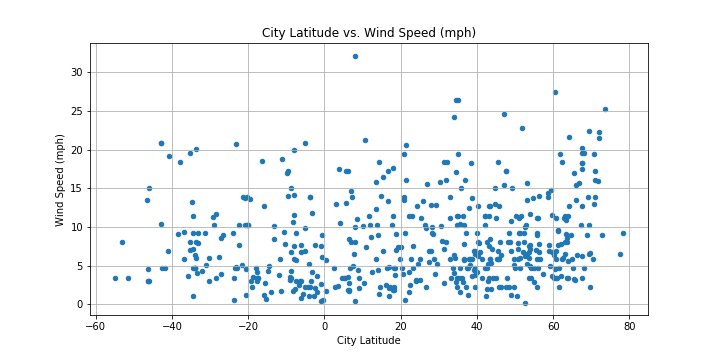

# API Weather Requests
Using Python API Requests &amp; JSON traversals to answer questions about the weather

Created a Python script to visualize the weather of 500+ cities across the world of varying latitudes:
- Used the [citipy Python library](https://pypi.python.org/pypi/citipy) with starter code provided
- used the [OpenWeatherMAP API](https://openweathermap.org/api) for API requests

Built a series of scatter plots that showcased the following relationships:
- Temperature (F) vs. Latitude
- Humidity (%) vs. Latitude
- Cloudiness (%) vs. Latitude
- Wind Speed (mph) vs. Latitude

Code includes a print log of each city as it is being processed.

[CSV](/Output/) of all data retrieved & [PNG images](/Images/) are also included.

# Temperature (F) vs. Latitude

# Humidity (%) vs. Latitude

# Cloudiness (%) vs. Latitude

# Wind Speed (mph) vs. Latitude

